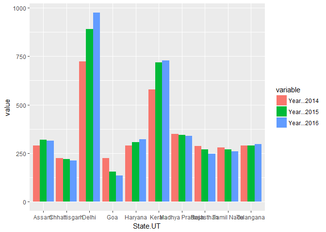

My first markdown
================

Read csv and Remove total rows from state and UT calculations

``` r
df <- read.csv("/Users/Ronak Shah/Downloads/datafile.csv")
df <- df[-c(30, 38),]
```

Divide crime rate by population

``` r
new_df <- cbind(df[c(2, 3)], df[,c(4, 5, 6)]/df[,9])
plot_df <- new_df[tail(order(new_df$Year...2014, new_df$Year...2015, new_df$Year...2016), 10), ]
plot_df
```

    ##    Category       State.UT Year...2014 Year...2015 Year...2016
    ## 5     State   Chhattisgarh    223.9323    218.1301    211.7314
    ## 6     State            Goa    224.4221    154.4724    135.2764
    ## 24    State     Tamil Nadu    277.9056    269.7900    258.7687
    ## 22    State      Rajasthan    287.1425    270.3057    246.1763
    ## 3     State          Assam    289.5549    318.0356    313.8428
    ## 8     State        Haryana    289.5581    305.9254    320.6338
    ## 25    State      Telangana    289.9050    288.4179    295.7693
    ## 14    State Madhya Pradesh    348.0999    343.2328    337.8712
    ## 13    State         Kerala    578.4308    719.0881    727.5441
    ## 35       UT          Delhi    724.3090    890.5398    974.9604

Plot the crime rate by population for 3 years for top 10 states

``` r
#Reshape from wide to long in R
new_df <- melt(plot_df, id.vars = c("Category", "State.UT"))
ggplot(new_df, aes(State.UT, value, fill = variable)) +
  geom_bar(stat="identity",position='dodge')
```


